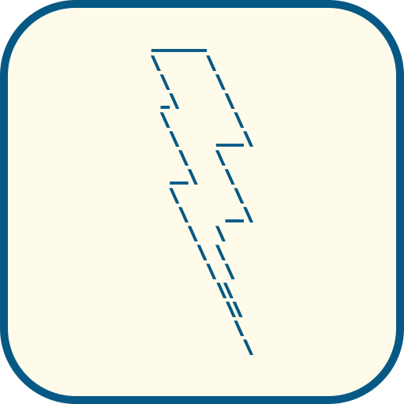

<!--
 Copyright 2026-present raml-dev
 SPDX-License-Identifier: AGPL-3.0-only
-->

<div align="center">

<html>
    <h2 align="center" style="display: flex; flex-direction: column; align-items: center; padding: 2rem">
      
    </h2>
    
</html>

**The lightweight, fast, open-source API client for modern development.**

[](https://github.com/raml-dev/solo/actions)
[](https://wails.io)
[](LICENSE)
[](https://app.fossa.com/projects/custom%2B61952%2Fgit%40github.com%3Araml-dev%2Fsolo.git?ref=badge_small)

[Features](#-features) • [Installation](#-installation) • [Contributing](#-contributing)

</div>

---

**Solo** is a high-performance API client built with _Wails_, combining the efficiency of a native desktop application with the modern flexibility. Designed to be fast, reliable, and versatile, Solo acts as a single hub for all your API testing and debugging needs.

<div align="center">
  
</div>


## ✨ Features

- **Blazing Fast**: Minimal memory footprint and instant startup.
- **Smart Collections**: Effortlessly organize and manage your REST requests.
- **Dynamic Environments**: Seamlessly switch variables between development, staging, and production.
- **Git Native Sync**: Synchronize collections directly via Git.
- **First-class Interoperability**: Import **Postman**, **Bruno**, and **OpenAPI**.
- **Advanced Scripting**: Extend your workflow with **Lua** pre-request and post-response scripts.
- **Automated Auth**: Built-in support for **OAuth2** token retrieval and automatic refresh.
- **Privacy First**: Your data stays local. No cloud account required, no tracking.

## Why Solo

As developers, we created Solo to solve a problem we had: popular API clients are either too slow, too bloated, or too restrictive. We know this is a common problem (just take a look at [AlternativeTo Postman](https://alternativeto.net/software/postman/)) and many alternatives exist, but we wanted to build our own client.

We enjoyed both developing and using Solo so far, so we decided to first distribute it to a small list of colleagues and friends, and now we are ready to share it with the community.

We _don't_ want to monetize this, and we surely _don't want your data_.

## 🚀 Installation

For detailed guides and full documentation, please visit our [website](https://solo.raml.workers.dev/installation/).

### Build from source

The easiest way to build Solo is using [mise](https://mise.jdx.dev/), which automatically manages all required dependencies including Go, Node.js, and the Wails CLI.

1. Clone the repository:
   ```bash
   git clone https://github.com/raml-dev/solo.git
   cd solo
   ```
2. Install dependencies and start the development environment:
   ```bash
   mise install
   mise run dev
   ```

## 🤝 Contributing

Contributions are welcome.

- Open an [Issue](https://github.com/raml-dev/solo/issues) for bugs or ideas
- Submit a [Pull Request](https://github.com/raml-dev/solo/pulls)

Read the [contribution guidelines](CONTRIBUTING.md) before opening an issue or submitting a PR.

---

<div align="center">
Made by the raml-dev team
</div>
